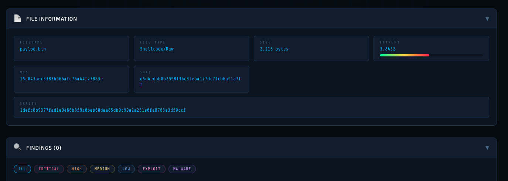

git clone https://github.com/3MPER0RR/multi-extension-analysis

cd multi-extension-analysis/reverse

python3 -m venv venv

pip3 install pefile yara-python capstone python-magic

## Linux (Debian/Ubuntu)
bash sudo apt install libmagic1 libmagic-dev

## macOS
brew install libmagic

## Usage

python3 analyzer.py malware.exe

python3 analyzer.py payload.bin --yara custom_rules.yar

python3 analyzer.py sample.js --out ./reports

python3 analyzer.py *.exe *.dll --out ./reports

python3 analyzer.py sample.bin --no-disasm

